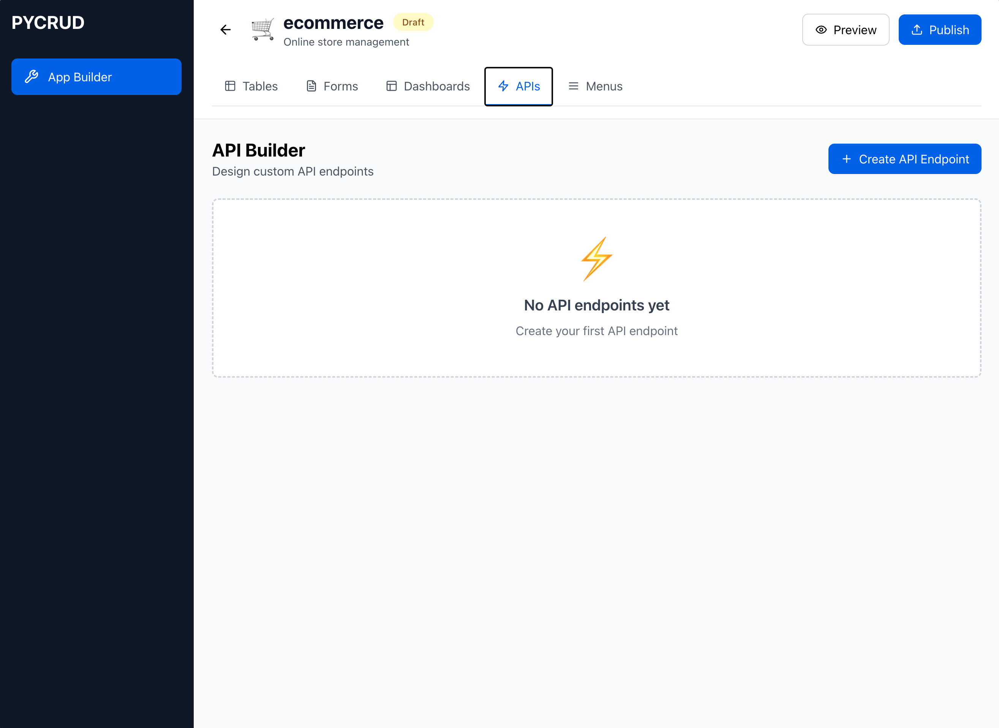
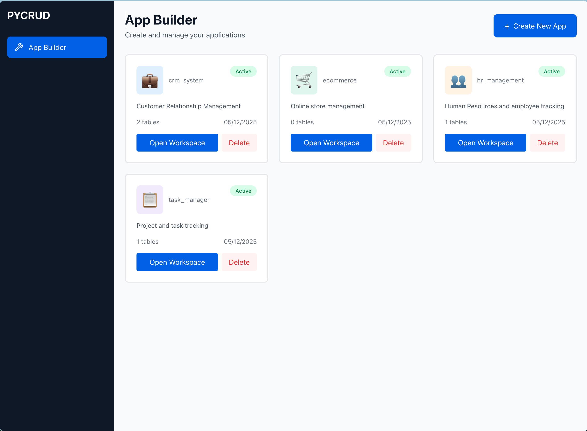

# PYCRUD - Dynamic Application Builder Platform

<div align="center">


[](https://www.docker.com/)
[](https://fastapi.tiangolo.com/)
[](https://reactjs.org/)
[](https://www.postgresql.org/)

**Build complete business applications without writing code**

A powerful meta-CRUD platform that lets you design tables, forms, dashboards, APIs, and menus through an intuitive visual workspace - then publish them as fully functional applications.

[Features](#-key-features) • [Quick Start](#-quick-start) • [Documentation](#-usage-guide) • [Architecture](#-architecture) • [API Docs](http://localhost:8000/docs)

</div>

---

## 📸 Screenshots

### Application Workspace

*Comprehensive workspace with Table Builder, Form Builder, Dashboard Builder, API Builder, and Menu Builder*

### Application Management

*Create and manage multiple applications with custom icons, colors, and publish states*

## 🎯 What is PYCRUD?

PYCRUD is not just a CRUD application - it's a **complete application builder platform**! Think of it as a low-code/no-code solution that empowers users to:

### 🚀 Key Features

#### **1. Visual Application Builder**
- Create unlimited applications with custom branding (icons, colors, descriptions)
- Group related functionality into cohesive applications
- Publish/unpublish with versioning support
- Track draft, published, and unpublished states

#### **2. Table Designer** 📊
- Design database tables with 8+ data types (string, integer, float, boolean, date, datetime, text, JSON)
- Define column validations (required, unique, max_length, min/max values, regex patterns)
- Set default values and help text
- Auto-generate database tables from visual designs

#### **3. Form Builder** 📝
- Create data entry forms linked to your tables
- Define field layouts and validation rules
- Auto-generate forms based on table schemas
- Smart field rendering based on column types

#### **4. Dashboard Builder** 📈
- Design analytics dashboards with multiple widget types
- Configure charts (bar, pie, line, donut)
- Set automatic refresh intervals
- Create custom layouts for data visualization

#### **5. API Builder** ⚡
- Define custom REST API endpoints
- Support all HTTP methods (GET, POST, PUT, PATCH, DELETE)
- Configure authentication requirements
- Define request/response schemas

#### **6. Menu Builder** 🗂️
- Create hierarchical navigation menus
- Set menu icons and routes
- Define parent-child relationships
- Configure permissions and ordering

#### **7. Workspace Interface** 💼
- Unified tabbed workspace for all builders
- Real-time statistics (table count, form count, etc.)
- Publish controls with status indicators
- Seamless navigation between builders

## 🏗️ Architecture

### Technology Stack

#### **Backend** (FastAPI + SQLModel + PostgreSQL)
```
🔹 Framework: FastAPI 0.109 - High-performance async web framework
🔹 ORM: SQLModel - Type-safe database operations with Pydantic validation
🔹 Database: PostgreSQL 15 - Robust relational database with JSON support
🔹 API Docs: Automatic OpenAPI/Swagger documentation
```

**Key Features:**
- 14 database tables for meta-CRUD architecture
- 8 REST API routers with full CRUD operations
- Dynamic table generation and schema management
- Publish/unpublish workflow with versioning
- Enum-based status management (DRAFT/PUBLISHED/UNPUBLISHED)
- Generic JSON storage for flexible data structures
- Comprehensive validation engine

#### **Frontend** (React + Vite + Tailwind)
```
🔹 Framework: React 18 - Modern component-based UI library
🔹 Build Tool: Vite 5 - Lightning-fast development and builds
🔹 Styling: Tailwind CSS 3 - Utility-first CSS framework
🔹 Icons: Lucide React - Beautiful consistent icons
```

**Key Components:**
- AppBuilder - Application listing and management
- AppWorkspace - Unified workspace with tabbed interface
- TableDesigner - Visual table schema creator (539 lines)
- FormBuilder - Form configuration interface (201 lines)
- DashboardBuilder - Dashboard layout designer (205 lines)
- APIBuilder - API endpoint configurator (234 lines)
- MenuBuilder - Navigation menu designer (228 lines)
- DynamicDataManager - Auto-generated CRUD interface

#### **Infrastructure** (Docker Compose)
```yaml
Services:
  ├── db (PostgreSQL 15)      - Port 5432
  ├── backend (FastAPI)       - Port 8000
  └── frontend (React+Vite)   - Port 3000
```

**Features:**
- One-command deployment with `docker-compose up`
- Hot reload enabled for development
- Health checks for all services
- Volume persistence for database
- Network isolation between services

## 🚀 Quick Start

### Prerequisites

Before you begin, ensure you have the following installed:

- ✅ **Docker Desktop** (version 20.10 or higher)
- ✅ **Docker Compose** (version 2.0 or higher)
- ✅ **Git** (for cloning the repository)

**System Requirements:**
- Ports available: 3000 (frontend), 8000 (backend), 5432 (database)
- Minimum 2GB RAM available
- 5GB free disk space

### Installation Steps

#### 1️⃣ Clone the Repository
```bash
git clone https://github.com/isathish/PythonCRUD.git
cd PythonCRUD
```

#### 2️⃣ Start All Services
```bash
# Start all containers in detached mode
docker-compose up -d

# Check service health
docker-compose ps
```

Expected output:
```
NAME                COMMAND              STATUS              PORTS
pycrud-db-1         postgres             Up (healthy)        0.0.0.0:5432->5432/tcp
pycrud-backend-1    uvicorn main:app     Up (healthy)        0.0.0.0:8000->8000/tcp
pycrud-frontend-1   npm run dev          Up                  0.0.0.0:3000->3000/tcp
```

#### 3️⃣ Access the Application

| Service | URL | Description |
|---------|-----|-------------|
| **Frontend** | http://localhost:3000 | Main application interface |
| **API Docs** | http://localhost:8000/docs | Interactive API documentation (Swagger) |
| **ReDoc** | http://localhost:8000/redoc | Alternative API documentation |
| **Health Check** | http://localhost:8000/health | Backend health status |
| **Database** | localhost:5432 | PostgreSQL (user: postgres, db: cruddb) |

#### 4️⃣ Verify Installation
```bash
# Check backend logs
docker-compose logs backend | tail -20

# Check frontend logs
docker-compose logs frontend | tail -20

# Test API endpoint
curl http://localhost:8000/api/v1/apps/
```

✅ **You're all set!** Open http://localhost:3000 and start building your first application.

## 💡 Usage Guide

### 🎬 Complete Walkthrough

#### **Step 1: Create Your First Application**

1. Open http://localhost:3000 in your browser
2. Click **"Create New App"** button
3. Fill in the application details:
   ```
   App Name:        my_crm          (lowercase, no spaces)
   Display Name:    My CRM          (user-friendly name)
   Description:     Customer relationship management system
   Icon:            👥              (choose from emoji picker)
   Color:           #3B82F6         (brand color)
   ```
4. Click **"Create App"**
5. Your app appears in the grid with stats showing 0 tables, 0 forms, etc.

#### **Step 2: Open the Workspace**

1. Find your newly created app in the grid
2. Click **"Open Workspace"** button
3. You'll see a tabbed interface with 5 builders:
   - 📊 Tables
   - 📝 Forms
   - 📈 Dashboards
   - ⚡ APIs
   - 🗂️ Menus

#### **Step 3: Design Your First Table**

**In the Tables tab:**

1. Click **"Create Table"**
2. Enter table details:
   ```
   Table Name:      customers
   Display Name:    Customers
   Description:     Customer contact information
   ```
3. Click **"Add Column"** to define fields:

   **Column 1 - Name:**
   ```
   Name:           name
   Display Name:   Customer Name
   Type:           string
   Required:       ✅ Yes
   Max Length:     100
   Help Text:      Full name of the customer
   ```

   **Column 2 - Email:**
   ```
   Name:           email
   Display Name:   Email Address
   Type:           string
   Required:       ✅ Yes
   Unique:         ✅ Yes (no duplicates)
   Max Length:     255
   Validation:     Regex pattern for email
   ```

   **Column 3 - Age:**
   ```
   Name:           age
   Display Name:   Age
   Type:           integer
   Required:       ❌ No
   Min Value:      18
   Max Value:      120
   ```

4. Click **"Create Table"**
5. Table is created in the database automatically!

**Available Data Types:**
| Type | Description | Validations |
|------|-------------|-------------|
| `string` | Short text | max_length, regex, unique |
| `text` | Long text | No length limit |
| `integer` | Whole numbers | min_value, max_value |
| `float` | Decimal numbers | min_value, max_value |
| `boolean` | True/False | N/A |
| `date` | Date only (YYYY-MM-DD) | N/A |
| `datetime` | Date + Time | N/A |
| `json` | Structured data | N/A |

#### **Step 4: Create Forms**

**In the Forms tab:**

1. Click **"Create Form"**
2. Enter form details:
   ```
   Name:           customer_form
   Title:          New Customer
   Description:    Form to add new customers
   Table:          customers (link to your table)
   ```
3. Define form fields (JSON array):
   ```json
   [
     {
       "name": "name",
       "type": "text",
       "required": true,
       "label": "Customer Name"
     },
     {
       "name": "email",
       "type": "email",
       "required": true,
       "label": "Email Address"
     }
   ]
   ```
4. Set validation rules and layout configuration
5. Click **"Create Form"**

#### **Step 5: Build Dashboards**

**In the Dashboards tab:**

1. Click **"Create Dashboard"**
2. Configure dashboard:
   ```
   Name:             customer_stats
   Title:            Customer Analytics
   Description:      Overview of customer metrics
   Refresh Interval: 30 (seconds)
   ```
3. Add widgets (JSON array):
   ```json
   [
     {
       "type": "stat",
       "title": "Total Customers",
       "query": "SELECT COUNT(*) FROM customers"
     },
     {
       "type": "chart",
       "chartType": "bar",
       "title": "Customers by Age",
       "query": "SELECT age, COUNT(*) FROM customers GROUP BY age"
     }
   ]
   ```
4. Click **"Create Dashboard"**

#### **Step 6: Define Custom APIs**

**In the APIs tab:**

1. Click **"Create Endpoint"**
2. Define endpoint:
   ```
   Name:                  get_active_customers
   Path:                  /customers/active
   Method:                GET
   Description:           Retrieve all active customers
   Authentication:        ✅ Required
   ```
3. Set request/response schemas (JSON)
4. Add custom logic if needed
5. Click **"Create Endpoint"**

**Supported HTTP Methods:**
- 🔵 GET - Retrieve data
- 🟢 POST - Create new records
- 🟡 PUT - Update entire records
- 🟠 PATCH - Partial updates
- 🔴 DELETE - Remove records

#### **Step 7: Build Navigation Menus**

**In the Menus tab:**

1. Click **"Create Menu"**
2. Create top-level menu:
   ```
   Label:      Home
   Icon:       🏠
   Route:      /home
   Order:      1
   ```
3. Create sub-menu (select parent):
   ```
   Label:      Customers
   Icon:       👥
   Route:      /customers
   Parent:     Home (dropdown)
   Order:      1
   ```
4. Build hierarchical structure
5. Click **"Create Menu"**

#### **Step 8: Publish Your App**

1. Review all components in workspace
2. Click **"Publish"** button in header
3. App status changes from DRAFT → PUBLISHED
4. Version increments automatically (v1, v2, v3...)
5. Published timestamp is recorded

**Status States:**
- 📝 **DRAFT** - Work in progress, not live
- ✅ **PUBLISHED** - Live and accessible to users
- ⏸️ **UNPUBLISHED** - Previously published, now offline

#### **Step 9: Manage Data**

1. Go back to Tables tab
2. Click **"Manage Data"** on any table
3. Click **"Add Record"**
4. Forms are auto-generated based on column types!
5. Enter data and click **"Save"**
6. Edit or delete records from table view

**Auto-Generated Form Fields:**
- String → Text input
- Integer → Number input (step=1)
- Float → Decimal input (step=0.01)
- Boolean → Checkbox or Yes/No dropdown
- Date → Date picker
- DateTime → Date-time picker
- JSON → Code editor with syntax highlighting

## 🔧 API Endpoints

### App Management
- `POST /api/v1/apps/` - Create app
- `GET /api/v1/apps/` - List apps
- `GET /api/v1/apps/{id}` - Get app details
- `PUT /api/v1/apps/{id}` - Update app
- `DELETE /api/v1/apps/{id}` - Delete app

### Schema Management
- `POST /api/v1/schema/apps/{app_id}/tables` - Create table
- `GET /api/v1/schema/apps/{app_id}/tables` - List tables
- `GET /api/v1/schema/tables/{table_id}` - Get table details
- `PUT /api/v1/schema/tables/{table_id}` - Update table
- `DELETE /api/v1/schema/tables/{table_id}` - Delete table
- `POST /api/v1/schema/tables/{table_id}/columns` - Add column

### Dynamic Data CRUD
- `POST /api/v1/data/{table_name}` - Create record
- `GET /api/v1/data/{table_name}` - List records (paginated)
- `GET /api/v1/data/{table_name}/{record_id}` - Get record
- `PUT /api/v1/data/{table_name}/{record_id}` - Update record
- `DELETE /api/v1/data/{table_name}/{record_id}` - Delete record

Full API documentation: http://localhost:8000/docs

## 🎨 Features Implemented

### ✅ Meta-CRUD System
- [x] App Builder - Create applications with icons and colors
- [x] Table Designer - Visual table creator with 8 column types
- [x] Dynamic Data Manager - Auto-generated CRUD forms
- [x] Validation Engine - Required, unique, max_length, min/max, regex
- [x] JSON Storage - Flexible schema-less data storage
- [x] REST API - Complete CRUD endpoints for all resources

### ✅ Static CRUD Examples
- [x] Users Management - Full CRUD with role-based filtering
- [x] Projects Management - Status tracking, budget, priorities
- [x] Tags Management - Visual color picker, grid view
- [x] Advanced Filter Builder - 11 operators with AND/OR logic

### ✅ Dashboard System
- [x] Dashboard Engine - Execute metrics, charts, tables
- [x] 6 Aggregations - count, sum, avg, min, max, distinct_count
- [x] 4 Chart Types - bar, pie, line, donut

### 🔄 Coming Soon
- [ ] Dynamic Dashboard Generator - Auto-create dashboards from schemas
- [ ] Relationship Visualizer - ER diagram viewer
- [ ] Export/Import Schemas - JSON schema migration

## 🧪 Testing the System

### Test via UI (Recommended)

1. **Go to http://localhost:3000**
2. **Click "App Builder" in sidebar** (🔧 icon)
3. **Create a test app**:
   - Name: `test_crm`
   - Display Name: `Test CRM`
   - Pick any icon and color
4. **Click "Manage Tables"**
5. **Create a table**:
   - Name: `customers`
   - Add columns: name (string, required), email (string, required, unique), age (integer)
6. **Click "Manage Data"**
7. **Add records** - forms are auto-generated!

### Test via API

```bash
# 1. Create App
curl -X POST http://localhost:8000/api/v1/apps/ \
  -H "Content-Type: application/json" \
  -d '{
    "name": "test_app",
    "display_name": "Test App",
    "icon": "📦",
    "color": "#3B82F6",
    "is_active": true
  }'

# 2. Create Table
curl -X POST http://localhost:8000/api/v1/schema/apps/1/tables \
  -H "Content-Type: application/json" \
  -d '{
    "name": "customers",
    "display_name": "Customers",
    "columns": [
      {
        "name": "email",
        "display_name": "Email",
        "column_type": "string",
        "is_required": true,
        "is_unique": true,
        "max_length": 255
      }
    ]
  }'

# 3. Create Data
curl -X POST http://localhost:8000/api/v1/data/customers \
  -H "Content-Type: application/json" \
  -d '{"email": "john@example.com"}'

# 4. List Data
curl http://localhost:8000/api/v1/data/customers
```

## 📊 Database Schema

PYCRUD uses a sophisticated meta-model architecture with **14 database tables**:

### Core Application Tables
| Table | Purpose | Key Fields |
|-------|---------|------------|
| `app` | Application containers | name, display_name, icon, color, publish_status, version |
| `table_schema` | Table definitions | name, display_name, app_id, is_active |
| `column_schema` | Column specifications | name, column_type, validations, constraints |
| `relationship_schema` | Table relationships | source_table, target_table, relationship_type |
| `dynamic_data` | Runtime data storage | table_name, data (JSONB), app_id |

### Component Tables (New Meta-CRUD Architecture)
| Table | Purpose | Key Fields |
|-------|---------|------------|
| `page` | Page configurations | name, title, route, layout (JSON), icon |
| `form_schema` | Form definitions | name, fields (JSON array), validation_rules, table_name |
| `dashboard_config` | Dashboard layouts | name, widgets (JSON array), refresh_interval |
| `api_endpoint` | Custom API endpoints | path, method, request_schema, response_schema |
| `menu_config` | Navigation menus | label, icon, route, parent_id, order, permissions |

### Enums
```python
PublishStatus:  DRAFT | PUBLISHED | UNPUBLISHED
FormFieldType:  TEXT | EMAIL | NUMBER | TEXTAREA | SELECT | ...
WidgetType:     CHART | TABLE | STAT | LIST | CARD
HTTPMethod:     GET | POST | PUT | PATCH | DELETE
```

### Key Relationships
```
app (1) ─────────── (N) table_schema
app (1) ─────────── (N) page
app (1) ─────────── (N) form_schema
app (1) ─────────── (N) dashboard_config
app (1) ─────────── (N) api_endpoint
app (1) ─────────── (N) menu_config
app (1) ─────────── (N) dynamic_data

table_schema (1) ── (N) column_schema
table_schema (1) ── (N) relationship_schema
table_schema (1) ── (N) form_schema (via table_name)

menu_config (1) ──── (N) menu_config (self-referencing for hierarchy)
```

## 🛠️ Development

### View Logs
```bash
# All services
docker-compose logs -f

# Specific service
docker-compose logs backend
docker-compose logs frontend
docker-compose logs db
```

### Restart Services
```bash
# Restart all
docker-compose restart

# Restart specific service
docker-compose restart backend
docker-compose restart frontend
```

### Rebuild After Code Changes
```bash
docker-compose down
docker-compose up --build -d
```

### Access Database
```bash
docker-compose exec db psql -U postgres -d crud_db

# View tables
\dt

# View table schema
\d table_schema
\d column_schema
\d dynamic_data
```

## 🚦 Troubleshooting

### Backend won't start
```bash
# Check logs
docker-compose logs backend

# Common fixes:
docker-compose restart backend
```

### Frontend shows blank page
```bash
# Check logs
docker-compose logs frontend

# Rebuild frontend
docker-compose down
docker-compose up --build -d
```

### Database connection issues
```bash
# Check if DB is healthy
docker-compose ps

# Restart database
docker-compose restart db
```

### Reset Everything (Nuclear Option)
```bash
# WARNING: Deletes all data
docker-compose down -v
docker-compose up --build -d
docker-compose exec backend python seed_data.py
```

## 🌟 What Makes PYCRUD Special?

### 1. **True Meta-CRUD Architecture**
Unlike traditional CRUD applications with fixed models, PYCRUD lets users **define their own data models at runtime**. Table schemas, forms, and APIs are stored as data, not hardcoded!

```
Traditional App:          PYCRUD:
Code → Models            User → Visual Designer → Models
Deploy to change         No deployment needed
Fixed structure          Infinite flexibility
```

### 2. **Unified Workspace Experience**
All builders are integrated into a single, cohesive workspace with:
- Tabbed interface for seamless navigation
- Real-time statistics and counts
- Publish/unpublish workflow with versioning
- Consistent UI/UX across all builders

### 3. **Generic JSON Storage**
All dynamic table data is stored in a single `dynamic_data` table with JSONB columns. This enables:
- Infinite schema flexibility
- No database migrations for new tables
- Fast schema evolution
- Complex data structures with JSON type

### 4. **Type-Safe Despite JSON**
Even with JSON storage, PYCRUD maintains type safety through:
- Schema-based validation engine
- Column type enforcement
- Constraint checking (required, unique, min/max)
- Regex pattern validation
- SQLModel Pydantic integration

### 5. **Auto-Generated Everything**
- **Forms** - Generated from table schemas automatically
- **CRUD APIs** - REST endpoints created on table creation
- **Validation** - Applied based on column constraints
- **UI Fields** - Rendered according to data types

### 6. **Component Isolation**
Each app is completely isolated:
- Separate schemas and data
- Independent publish states
- Individual versioning
- No cross-app contamination

### 7. **Production-Ready Architecture**
```
✅ Docker Compose orchestration
✅ Environment-based configuration
✅ Hot reload for rapid development
✅ Health checks for all services
✅ Comprehensive error handling
✅ API pagination and filtering
✅ Input validation and sanitization
✅ SQL injection protection via SQLModel
✅ CORS configuration
✅ Logging and monitoring ready
```

### 8. **Developer-Friendly**
- **OpenAPI/Swagger** - Auto-generated API documentation at `/docs`
- **Type Hints** - Full Python type annotations
- **Modern Stack** - FastAPI + React + PostgreSQL
- **Hot Reload** - Changes reflect instantly
- **Clear Architecture** - Well-organized codebase

## 📁 Project Structure

```
PythonCRUD/
│
├── backend/                           # FastAPI Backend
│   ├── core/
│   │   ├── config.py                 # Environment settings
│   │   └── database.py               # PostgreSQL connection
│   │
│   ├── models/
│   │   └── schema_builder.py        # All data models (537 lines)
│   │                                  # - App, TableSchema, ColumnSchema
│   │                                  # - Page, FormSchema, DashboardConfig
│   │                                  # - APIEndpoint, MenuConfig
│   │                                  # - 4 Enums (PublishStatus, etc.)
│   │
│   ├── routers/
│   │   ├── apps.py                   # App CRUD + publish (186 lines)
│   │   ├── schema_builder.py        # Table schema CRUD (170 lines)
│   │   ├── dynamic_data.py           # Dynamic data CRUD (130 lines)
│   │   ├── pages.py                  # Page management (104 lines)
│   │   ├── forms.py                  # Form management (104 lines)
│   │   ├── dashboards.py             # Dashboard management (104 lines)
│   │   ├── api_endpoints.py          # API endpoint management (110 lines)
│   │   └── menus.py                  # Menu management (126 lines)
│   │
│   ├── services/
│   │   └── table_generator_service.py  # Business logic (293 lines)
│   │
│   ├── main.py                       # FastAPI app entry (52 lines)
│   ├── requirements.txt              # Python dependencies
│   └── Dockerfile                    # Backend container config
│
├── frontend/                          # React Frontend
│   ├── src/
│   │   ├── pages/
│   │   │   └── AppBuilder.jsx        # App listing (~270 lines)
│   │   │
│   │   ├── components/
│   │   │   ├── AppWorkspace.jsx      # Workspace UI (177 lines)
│   │   │   ├── TableDesigner.jsx     # Table builder (539 lines)
│   │   │   ├── FormBuilder.jsx       # Form builder (201 lines)
│   │   │   ├── DashboardBuilder.jsx  # Dashboard builder (205 lines)
│   │   │   ├── APIBuilder.jsx        # API builder (234 lines)
│   │   │   ├── MenuBuilder.jsx       # Menu builder (228 lines)
│   │   │   ├── DynamicDataManager.jsx # Data manager (370 lines)
│   │   │   └── Sidebar.jsx           # Navigation sidebar
│   │   │
│   │   ├── api/
│   │   │   └── api.js                # API client with axios
│   │   │
│   │   ├── App.jsx                   # Main app with routing
│   │   └── main.jsx                  # React entry point
│   │
│   ├── package.json                  # Node dependencies
│   ├── vite.config.js                # Vite configuration
│   ├── tailwind.config.js            # Tailwind CSS config
│   └── Dockerfile                    # Frontend container config
│
├── docker-compose.yml                # Multi-container orchestration
├── .env.example                      # Environment template
├── .gitignore                        # Git ignore rules
├── README.md                         # This file
├── screenshot-app-list.png           # App management screenshot
└── screenshot-workspace.png          # Workspace screenshot

Total Lines of Code:
  Backend:  ~2,200 lines
  Frontend: ~2,700 lines
  Total:    ~4,900 lines
```

## 🎓 Learning Resources & Concepts

This project is an excellent learning resource for:

### **Backend Development**
- ✅ **FastAPI** - Modern async Python web framework with auto-docs
- ✅ **SQLModel** - Type-safe ORM combining SQLAlchemy + Pydantic
- ✅ **Pydantic Validation** - Request/response models with type checking
- ✅ **PostgreSQL** - Advanced features (JSONB, enums, relationships)
- ✅ **REST API Design** - Resource-based endpoints, proper HTTP methods
- ✅ **Dependency Injection** - FastAPI's DI system for database sessions
- ✅ **Error Handling** - HTTP exceptions and proper status codes
- ✅ **CORS Configuration** - Cross-origin resource sharing

### **Frontend Development**
- ✅ **React 18** - Modern component-based UI with hooks
- ✅ **React Hooks** - useState, useEffect, custom hooks
- ✅ **Component Architecture** - Reusable, maintainable components
- ✅ **State Management** - Local state with hooks
- ✅ **API Integration** - Axios for HTTP requests
- ✅ **Tailwind CSS** - Utility-first styling approach
- ✅ **Responsive Design** - Mobile-friendly layouts
- ✅ **Form Handling** - Controlled inputs, validation

### **DevOps & Infrastructure**
- ✅ **Docker** - Containerization for consistent environments
- ✅ **Docker Compose** - Multi-container orchestration
- ✅ **Environment Variables** - Configuration management
- ✅ **Health Checks** - Service monitoring
- ✅ **Volume Management** - Data persistence
- ✅ **Network Isolation** - Container networking

### **Architecture Patterns**
- ✅ **Meta-Programming** - Dynamic model generation
- ✅ **Repository Pattern** - Data access abstraction
- ✅ **Service Layer** - Business logic separation
- ✅ **API Gateway Pattern** - Centralized routing
- ✅ **Builder Pattern** - Visual schema construction
- ✅ **Generic Types** - Flexible, reusable code

### **Database Design**
- ✅ **Schema Design** - Normalized tables with relationships
- ✅ **JSONB Storage** - Schema-less flexible data
- ✅ **Enums** - Type-safe status values
- ✅ **Foreign Keys** - Referential integrity
- ✅ **Cascading Deletes** - Data consistency
- ✅ **Indexing** - Query performance optimization

## 🤝 Contributing

Contributions are welcome! This project can be extended in many ways:

### **Potential Enhancements**
- [ ] Visual query builder for complex filters
- [ ] Drag-and-drop form field designer
- [ ] Dashboard widget library with more chart types
- [ ] User authentication and authorization
- [ ] Role-based access control (RBAC)
- [ ] API testing interface within workspace
- [ ] Export/import app configurations
- [ ] Database migration tools
- [ ] Real-time collaboration features
- [ ] Mobile app for management

### **How to Contribute**
1. Fork the repository
2. Create a feature branch (`git checkout -b feature/amazing-feature`)
3. Commit your changes (`git commit -m 'Add amazing feature'`)
4. Push to the branch (`git push origin feature/amazing-feature`)
5. Open a Pull Request

## 📞 Support & Documentation

| Resource | URL | Description |
|----------|-----|-------------|
| **API Documentation** | http://localhost:8000/docs | Interactive Swagger UI |
| **ReDoc** | http://localhost:8000/redoc | Alternative API docs |
| **Health Check** | http://localhost:8000/health | Backend status |
| **Frontend App** | http://localhost:3000 | Main application |
| **GitHub Issues** | [Report Issues](https://github.com/isathish/PythonCRUD/issues) | Bug reports & features |

## 📄 License

```
MIT License

Copyright (c) 2025 PYCRUD

Permission is hereby granted, free of charge, to any person obtaining a copy
of this software and associated documentation files (the "Software"), to deal
in the Software without restriction, including without limitation the rights
to use, copy, modify, merge, publish, distribute, sublicense, and/or sell
copies of the Software, and to permit persons to whom the Software is
furnished to do so, subject to the following conditions:

The above copyright notice and this permission notice shall be included in all
copies or substantial portions of the Software.

THE SOFTWARE IS PROVIDED "AS IS", WITHOUT WARRANTY OF ANY KIND, EXPRESS OR
IMPLIED, INCLUDING BUT NOT LIMITED TO THE WARRANTIES OF MERCHANTABILITY,
FITNESS FOR A PARTICULAR PURPOSE AND NONINFRINGEMENT.
```

## 🎯 Project Status

```
✅ Application Builder - Fully functional
✅ Table Designer - Complete with validations
✅ Form Builder - Working with field definitions
✅ Dashboard Builder - Widget support implemented
✅ API Builder - Endpoint configuration ready
✅ Menu Builder - Hierarchical menus working
✅ Publish Workflow - Versioning implemented
✅ Docker Setup - All services orchestrated
✅ Documentation - Comprehensive README

Status: Production Ready 🚀
Version: 1.0.0
Last Updated: December 2025
```

## 🌟 Acknowledgments

Built with modern technologies and best practices:

- **[FastAPI](https://fastapi.tiangolo.com/)** - High-performance Python web framework
- **[React](https://reactjs.org/)** - Modern UI library for building interfaces
- **[SQLModel](https://sqlmodel.tiangolo.com/)** - SQL databases in Python with type hints
- **[PostgreSQL](https://www.postgresql.org/)** - Powerful open-source database
- **[Tailwind CSS](https://tailwindcss.com/)** - Utility-first CSS framework
- **[Vite](https://vitejs.dev/)** - Next-generation frontend tooling
- **[Docker](https://www.docker.com/)** - Containerization platform
- **[Lucide Icons](https://lucide.dev/)** - Beautiful consistent icon set

---

<div align="center">

**PYCRUD - Build Powerful Applications Without Writing Code** 🚀

[](https://github.com/isathish/PythonCRUD)
[](https://github.com/isathish/PythonCRUD)

*Made with ❤️ by developers, for developers*

[Get Started](#-quick-start) • [Documentation](#-usage-guide) • [Contribute](#-contributing)

</div>
